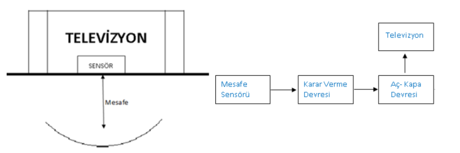
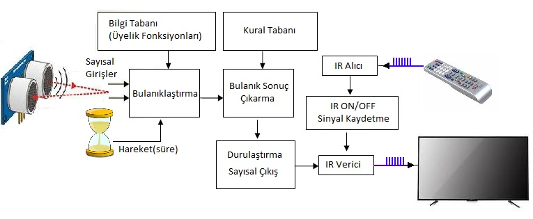

## **Küçük Çocukların Televizyonu Yakından İzleme Problemine Bulanık Mantık Yaklaşımı**

### Giriş :

Günümüzde televizyonun olmadığı ev neredeyse yok gibidir. Birçok anne baba çocuklarını yetiştirirken onların televizyonu yakından izlemelerine şahit olmuş ve bunu kendilerince yöntemlerle engellemeye çalışmıştır. Sevdiği çizgi filmi veya reklamları televizyona yapışık gibi izleyen bir çocuk görüntüsünden rahatsız olmayacak anne baba herhalde yoktur.

Çocukların neden televizyonu yakından izledikleri konusunda yapılan bazı incelemelerde bunun neden değil sonuç olduğu ve çocuğun göz bozukluğu kusurlarından birine sahip olabileceği
söylenmektedir. Bunun yanı sıra çocuğun dikkat çekmek, uyaranların canlılığı vb. gibi sebeplerden
dolayı da yakından izlediği düşünülmektedir(“Televizyonu izleme uzaklığı ne olmalı?”).

Televizyonu yakından izlemenin erken dönemde çocuklara ve özellikle gözlere büyük bir
zararının olmadığı tespit edilmiştir. Gözlerin yorulması parlak yüzeye bakılması az da olsa
elektromanyetik alana maruz kalıma vb. zararlarının olabileceği tespit edilmiştir(“Yakından
televizyon izlemenin zararları”,2012)(“ Teknolojinin Çocuklara Zararları Nelerdir”)(“ Televizyonu
Yakından İzlemenin Zararları”). En önemli etkisi ise televizyon izleme alışkanlığını
kazandırmasıdır ve onun gelişim açısından küçük çocuklar üzerindeki zararları ise sayılmayacak
kadar çoktur.

Her şeye rağmen hiçbir anne babanın da çocuklarının televizyonu yakından izlemesine razı
olabileceği düşünülemez. Hele ki uzmanların 0-4 yaş arasında televizyonun mümkünse hiç
izlenmemesini tavsiye ettiği günümüzde.

Fakat anne babalar sosyal hayatın karmaşası içinde bu konuda yalnız kalmıştır.
Televizyonun cazibedarlığı ve sosyal hayatın yoğunluğu onları çaresiz bir durumda bırakmıştır.
Çocukların televizyonu yakından izlenmesini yaşamayan anne baba neredeyse yok gibidir.
Burada etkili televizyon izleme mesafesi akla gelmektedir. Yapılan çalışmalar televizyonun
ekran boyutunun (köşeden köşeye) 2 katı mesafesinin uygun olabileceği sonucunu vermiştir. Etkili
ve sağlıklı bir izleme için bu mesafenin dışında olmak gerekir yakınlaştıkça yukarıda anlatılan
sorunların ortaya çıkma olasılıkları artmaktadır(“Led TV İzleme Mesafeleri”).

Peki, çocuktaki bu tür bir davranışı giderme adına çözüm önerileri nelerdir? Genelde verilen
çözümlerin büyük bir çoğunluğu tavsiyelerden oluşmaktadır(“Televizyonu izleme uzaklığı ne
olmalı?”). Yaptığımız araştırmalarda, kullanılan bir cihaz, araç veya televizyonlara ait bir özellik
bulamadık

### **Projenin Amacı** :
Küçük çocukların televizyonu yakından izlemelerini engelleyen ve çocuklarda yakından
televizyon izlememe davranışı kazandıran bir sistem geliştirmek.

### **Yöntem** :
İlk çalışmalarımız da mesafe ölçebilen bir sensör ile mesafe ölçülüp tespit edilen sınırın
içine girildiğinde televizyonun kapatılması ve çıkıldığında ise televizyonu açılması şeklinde
çalışabilecek bir yapı üzerinde duruldu

Fakat bu yaklaşım keskin bir şekilde çalışıyor ve küçük çocuğun televizyon önündeki
davranışlarını ya da televizyonun önünde olan herhangi bir kişinin davranışı tam anlamıyla kestiremiyordu. Çalışma şekli kullanım açısından uygunluk göstermedi. Bu denetleme yapısının eksik kaldığını gördük.

Bu noktada televizyonun bulunduğu yerdeki koşullara uyum sağlayabilecek ve televizyon
önündeki davranışları analiz ederek yakından izleme olayını tespit edip belirlenen kurallar
çerçevesinde çocuklarda davranış geliştirmeye yardımcı olacak bir yöntem üzerinde durulmaya
başlandı. Geliştirilecek cihazın çözüm algoritmasının insani düşünceye ve hayata uyumlu olması
gerekiyordu. Bulanık mantık yaklaşımlarının buna uygun olduğunu gördük (Elmas, 2007) ve
çalışmamızı bulanık mantık ile çözüm geliştirme üzerinde yoğunlaştırdık.

**Keskin Mantık ve Bulanık Mantık**

Geleneksel mantık, olayları 0 veya 1 ( var veya yok, doğru veya yanlış ) şeklinde ele alır. Bir
olay için yalnızca iki durum söz konusudur. Bulanık mantık ise olayları 0 ve 1 arasındaki gerçek
değerleriyle ifade eder (“Fuzzy Logic”).

**Küçük Çocukların Televizyonu Yakından İzlemesini Engelleyen Uygulamanın
Geliştirilmesi**

Televizyon önündeki bir çocuğun hareketlerinin analiz edilebilmesi için mesafeyle beraber o
mesafede kalınan süreninde dikkate alınması uygun olacaktır. Yani televizyonun izlendiğini
anlamak için hareket-hareketsizlik miktarının incelenmesi gerekecektir. Bu durumda sistemimiz,
aslında televizyon için belirlenen sınır uzaklık miktarında hareket-hareketsizlik analizi yaparak
sonuca ulaşacaktır.

Televizyonun açma kapama yöntemi olarak ta kumandadan açma kapama butonuna basıldığında
televizyonun infrared alıcısına giden bilgi önceden yakalanıp kaydedilerek sistem tarafından
bulanık çıkarım sonucuna uygun olarak tekrar gönderilmesinin kullanım açısından en uygun
seçenek olacağı sonucuna varılmıştır.

Buna göre donanımda kullanılacak malzeme listesi şu şekildedir;
- Arduino Uno ya da Mega.
- IR alıcı-verici (1’er adet)
- HC-RS04 ultrasonik sensör (2 adet).
- Led (2 adet).
- Direnç, güç kaynağı vb.

**Kullanılan Teknolojiler :**

1. Mikrodenetleyiciler Arduino UNO (Atmega328P)
2. Bulanık Mantık (Fuzzy Logic) ve c++ uygulamaları.
3. C++ ile arduino programlama.
4. Uzaklık algılama.
5. PCB teknikleri

## **Not** : 
Bu çalışma ,

TUBİTAK 47. ORTAÖĞRETİM ÖĞRENCİLERİ ARAŞTIRMA PROJELERİ YARIŞMASI 'nda BİLGİSAYAR dalında  **TÜRKİYE üçüncüsü** olmuştur (06.05.2016).
